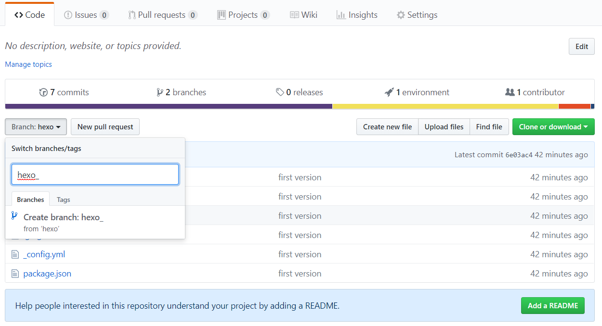
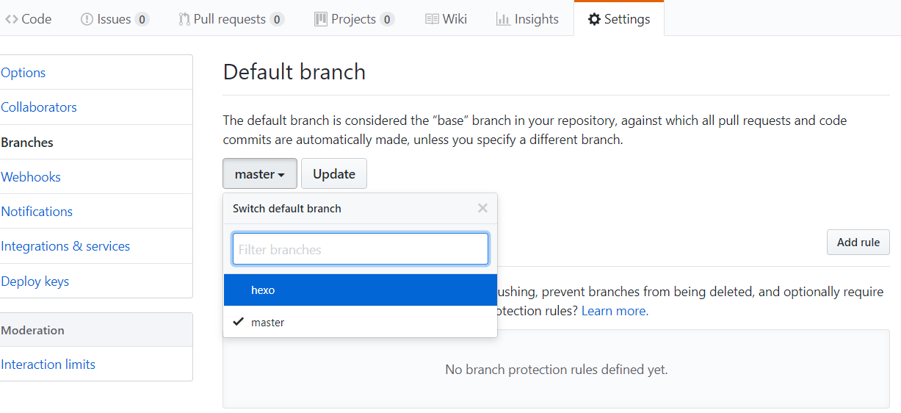
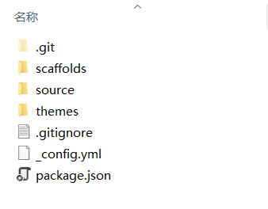
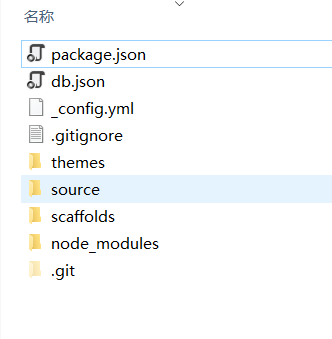
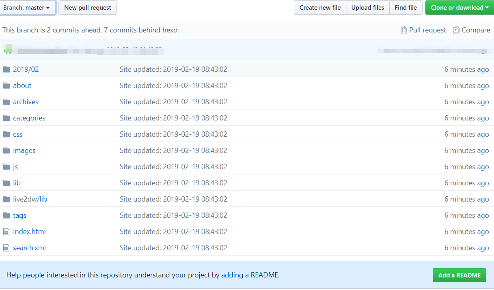
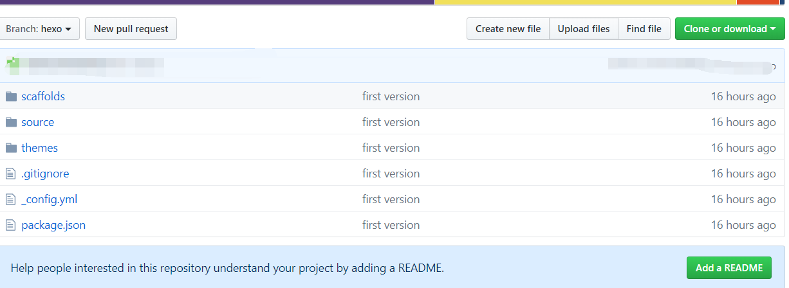

<!-- 标签别名 -->
 
配置Next主题


<!-- more -->


##  1. 建立并发布博客

在github上建立并发布hexo博客

参考：



##### 注意部署配置里加上分支配置

branch: master

```yaml
deploy:
  type: git
  repo: https://github.com/OneYuanYuanYuan/OneYuanYuanYuan.github.io.git
  branch: master
```


##  2. 建立分支

在github上的xxx.github.io仓库中，新建分支(已发布的静态博客默认是master分支)。

1. 在仓库的Code页面，branch的下拉条中输入hexo，并确定创建。




2. 设置分支为默认分支

在仓库的Settings页面，在左侧选择Branches页。点击分支下拉列表，选中hexo，并点击update按键。



此时回到code页面，切换分支，会发现2个分支的内容是一样的。


## 3. 上传文件到分支

1. clone hexo分支

```bash
git clone https://github.com/xxx/xxx.github.io.git <folder name>
```

其中folder name是指定的文件夹名。


2. 替换文件

clone后，当前文件夹里的文件如下图：



删除除了.git以外的所有文件。同时替换为之前生成博客的文件夹里的文件。



3. 修改.gitignore

```yaml
.DS_Store
Thumbs.db
db.json
*.log
node_modules/
public/
.deploy*/
```

themes/文件夹下，各主题里如果有.git文件夹，都必须删除，否则主题文件不会上传到git，导致在另一台电脑上clone文件时，没有主题文件，无法生成静态博客页面。

db.json：hexo g时会自动生成

node_modules: npm install时会自动生成

public: hexo g时会自动生成

.deploy_git: 在使用hexo d时也会重新生成


4. 提交

使用git提交文件

```bash
git add .
git commit -m "first version"
git push
```

此时可以在github仓库里看到下列文件

master branch




hexo branch




到此，博客的源文件已全部上传到github上。


## 4. 在另一台电脑编写发布博客

#### 1. 安装环境

安装[git](https://git-scm.com/download/win)
安装[Node.js](https://nodejs.org/en/)


#### 2. 安装hexo

```bash
npm install -g hexo-cli 
```


#### 3. 安装自动发布的插件

```bash
npm install hexo-deployer-git --save
```


#### 4. 从github上下载源文件

```
git clone https://github.com/xxx/xxx.github.io.git <folder name>
```

其中folder name是指定的文件夹名。


#### 5. hexo 编写和发布

进入下载的源文件文件夹。

注意不要使用hexo init命令。因为当前目录已经从github仓库中下载了hexo环境，使用hexo init会覆盖之前的文件，重建一个新的。

这里只需要安装各种插件再发布即可

```bash
npm install
```

因为package.json里面已经保存了hexo的各种插件资源信息，直接安装即可，同时会生成node_modules文件夹。

之后，就可以新建文章，发布。

```bash
hexo new <title>
hexo g
hexo s
```

发布

```bash
hexo d
```


#### 6. 上传新文件

```bash
git add .
git commit -m "info"
git push
```


#### 7. hexo仓库更新

下次进行Hexo仓库拉取时执行：

```
git fetch --all #将git上所有文件拉取到本地
git reset --hard origin/master  #强制将本地内容指向刚刚同步git云端内容
```


reset 对所拉取的文件不做任何处理，此处不用 pull 是因为本地尚有许多文件，使用 pull 会有一些版本冲突，解决起来也麻烦，而本地的文件都是初始化生成的文件，较拉取的库里面的文件而言基本无用，所以直接丢弃。


